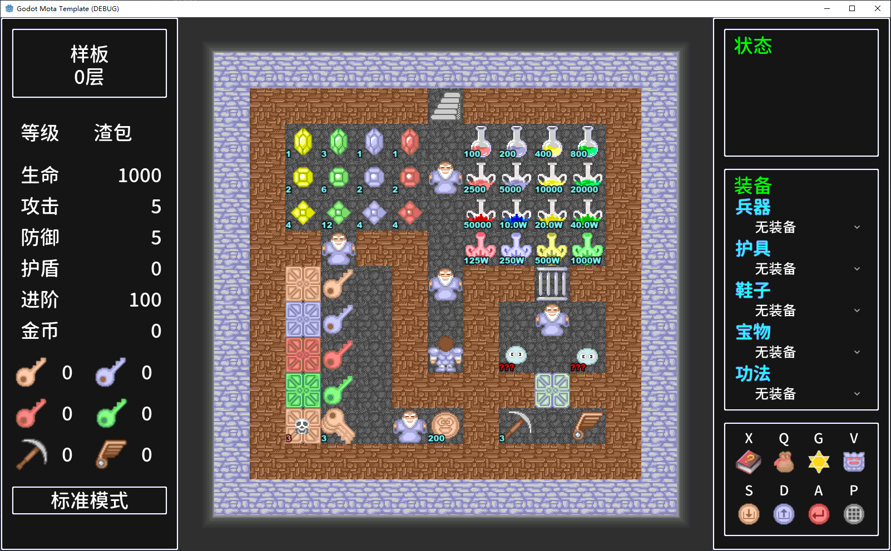
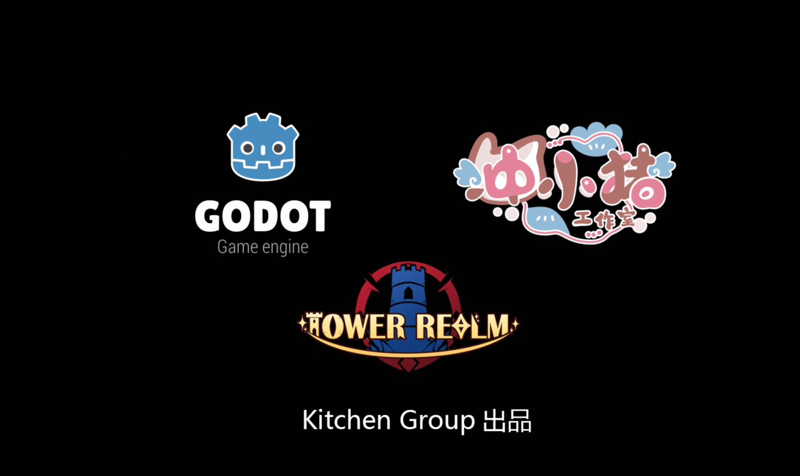

# GodotStandardMotaTemplate

## 项目介绍

基于Godot 4.5.2版本的魔塔样板。
* 基于Godot引擎，支持多平台导出
* 支持RPG MAKER系列的素材，您可以购买RPG MAKER系列的素材快速用于地图绘制
* 可视化事件系统，简单上手
* 样板正在开发中，如有使用上的问题和需求，可联系我们。

基于该魔塔样板的作品：
* [《魔塔国度 -Tower Realm-》](https://store.steampowered.com/app/4550370/_Tower_Realm/)
* [《绯红编年史 ~ Chronicle of Scarlet ~》](https://store.steampowered.com/app/3117660/__Chronicle_of_Scarlet/)

## 上手

首先需要下载Godot 4.5.2

* [Godot 4.5.2-stable](https://godotengine.org/download/archive/4.5.2-stable/)

使用4.5.1打开此工程即可上手

在 Scene/Map/Template中打开其中的场景文件，打开样板层开始学习吧！

如果你第一次接触godot引擎，建议先了解一下引擎的基础知识，参考一下各个平台上的视频教程

为了上手制作的话，仅仅了解基础的引擎各个界面、节点与场景即可

## 制作教程

1.配表
作为策划，最重要的便是配表了
所有的原始表在res://Datatable/DatatableExcel中，相当于全游戏的数据库
在表有修改后，你还需要在编辑器中进行一个叫[导表]的操作，才能实际生效。
导表按钮在编辑器中  项目-工具-ExcelExport

2.新建地图
推荐在空白地图 Scene/Map/EmptyMap.tscn
右键-复制为
复制出新地图后再进行归类，放到你想放的文件夹中！
* 然后一定要记得在Map表中加入上这个地图的相关信息，否则是不认的！

3.画地图
选中TileMap节点后，在下方选中图块后就可以画就完事了
复制出来的场景默认有三层，一定要选好层再画
想要更多层可以在tilemap节点的设置中新加

如果想要画autotile需要使用地形
对于已经设置好的地形，选中之后画就完事了

选中对应的TileSet可以编辑图块，自定义属性中有图块通行度等属性，当passable和上下左右的passable都勾选上后一个图块才能自由通行！
如果想要在TileSet中新添加普通图块，动画图块和地形，则需要图块相关的进阶知识。

关于Zindex:
地板在0
一般事件和比普通地板高一点的地板在1
需要ysort的事件和玩家和需要ysort的墙在2
比事件高的在3

4.摆事件
摆事件你需要先开启吸附
在上方的栏中找到“使用栅格吸附”

* 不要用智能吸附！！他会把你的事件在弄歪
* 这个严格的吸附需要在旁边的省略号处进行设置，仅勾选“使用像素吸附”并在设置吸附里设置步长为64（一格的大小）即可

有了吸附，就可以快速准确的移动想要的事件！
此外还需要迅速复制事件的方法，在选择好一个事件后可以在原位按Ctrl+D实现迅速在同级创建副本，此时再拉开事件到你想要的位置，防止重叠，就可以快速复制。
不同地图Ctrl+C复制过来的事件，则需要先点一下空位（由于其他基本都上锁，所以一般会选择到所有事件所在的父节点），标定好在场景树中复制的位置，然后再Ctrl+V复制即可。

对于每一个事件，他的节点名称就是他的事件id
godot不允许子节点重名，因此复制出来的必然是不同的id

5.事件设置

大部分设置都在GameEvent的子节点，也就是每一个事件页之中
Trigger：如何触发，包括接触触发，自动触发，异步自动触发和并行处理
EventPassable：事件是否允许通行
FindPathPassable：事件是否会被自动寻路认为是障碍
OnPageFinished：当执行完毕这一页后是翻页（Next），还是不动（Hold），还是直接结束（Dead），你也可以使用Customize手动指定执行完后进入哪一页
CustomizeNextPage：Customize时执行完后进入哪一页

同时在FrameAnimation之下还有
插件支持：一般保留true即可
IdleAnim：停止时动画
MovingAnim：移动时动画
NoDirection：固定朝向

在Texture里选择行走图
并在Frame处选择具体在哪一个位置

6.事件编辑器

在面对制作演出和剧情的需求时，你可以使用事件编辑器来编辑事件。
首先在事件页上挂载CombinedEvent脚本，在启用插件后，右侧的MT栏就可以编辑事件的信息

点击“^”按钮打开事件编辑器webview后就可以自行发挥，你可以通过样板层中的各个例子观察各个事件的用法！

详细介绍在下面的事件编辑器一节中

7.初始状态
所有的初始状态都在GameFirstData.gd之中，直接对其中的常量进行修改即可
使用Ctrl+P可以快速打开想要的场景/脚本！

## 文件结构

1. 资源文件夹（Resources）
用来放置游戏中用到的资源，包括：
Animation		- 动画图片资源
Audio			- 音频资源
Character		- 行走图
Font			- 字体
Icon			- 图标
Picture			- 图片
Tilesets		- 图块
UI				- UI资源

2. 场景文件夹（Scene）
包含所有的场景，其中包括：
CommonEvent		- 公共事件预制件
Effect			- 特效预制件
Map				- 地图场景
Prefab			- 当预制件使用的通用场景
Procedure		- 游戏状态的根场景
UI				- UI界面场景

3. 脚本（Script）
包括所有的脚本
全游戏的入口在Preload场景中，也就是上面挂载的ProcedurePreload.gd
Audio		- 音频相关
Config      - 配置
Procedure	- 包含一个简易的状态系统，进入下一个大状态会卸载掉当前场景的所有东西
Defination	- 一些常量，数据结构的定义
Effect		- 特效相关
Game		- 游戏内的代码
Save        - 存读档管理
Resource	- 资源管理相关
UI			- UI相关
Utility		- 工具类

MotaSystem	- 提供全游戏所有系统的入口，设置为自动加载，可以在任何地方使用MotaSystem.xxxx来访问想要的模块的数据或方法

## 脚本系统

全游戏系统入口		-MotaSystem

进入游戏入口为ProcedurePreload
首先介绍Procedure，Procedure可以理解为一个完整的最低层游戏状态，每次切换Procedure都会将场景树全部重置
统一在ProcedureManager中进行管理
因此在进入ProcedurePreload后便开始执行相关的预加载等逻辑，完成后切换到PrecedureMainMenu，也就是主界面Procedure，在玩家点开游戏后进入ProcedureMainGame

进入正式游戏后，GameManager调度并管理所有游戏系统模块，包括：

MapManager          - 管理地图
InputManager        - 管理输入处理
GameEventManager    - 事件管理器
GameData            - 负责全部游戏数据
GameForm            - 游戏主UI
HintForm            - 右上角的提示UI

## 导表操作说明

导表工具：
https://github.com/kaluluosi/GDExcelExporter

数据表xlsx位置：Datatable/DatatableExcel
数据表导出后脚本位置：Datatable/Dist

在修改xlsx数据表后，需要使用一键导表按钮将其变为gd脚本，然后就以在任何地方使用DatatableManager.[表名].data来使用表中数据了
导表按钮在 项目-工具-ExcelExport
*注意* 有时候在编辑器内导表会导致闪退，如果不想被闪退困扰，可以在Datatable文件夹中双击文件"gen_all.bat"一键导表

如果要添加新表，可以参考Datatable/sample中的示例文件，必须按照对应格式才有效

## 拼UI操作说明

UI一般为一个场景，包含若干control节点，其中根节点上挂载一个脚本负责该UI的各类功能

在新建UI时，需要先将UI表中添加应的UI，并设置对应的UI层和资源位置等信息
UI层分为Main,Game,PopUp，分别为游戏内各类UI，主界面等界面UI，弹窗UI
在UI表添加完之后记得导表

随后需要来到Defination.gd中（按ctrl+p可以快速打开），有一个UIID的枚举，里面将你新添加的ID加入
然后在任意代码中使用MotaSystem._UIManager.open()即可打开置好的UI了

每个UI脚本在继承UIForm后，在ready结束后都会执行可以带参数的initialize
不过在实现UI逻辑时需要自行解析param

## 创建事件，使用事件操作说明

首先在地图下添加子节点-GameEvent
然后一个没有任何事件页的事件就创建好了，接下来需要加入事件页
在GameEvent下创建一个你想要类型的事件页，在Script/Game/Event里面有一些常用的事件页模版，分为：

消耗品（consumable）		                -拿取后直接加属性数值等
道具（item）				                -拿取后增加角色道具或装备
怪物（monster）			                    -打怪
障碍物（barrier）			                -各种门等障碍物
机关障碍（regionbarrier/conditionbarrier）	-机关门
传送点 (teleport/teleporttower)             -适用于塔外/塔内传送的传送点
陷阱 (trap)                                 -血网等陷阱
条件 (condition)                            -当满足条件时切换走的事件
空事件 (empty)                              -空事件
综合事件(combined)                          -可以使用事件编辑器的事件

选择你想使用的事件页新建在GameEvent下后，就可以调整各种属性了
这些事件页模版都继承了EventPage，如果选择EventPage则是白板页
新建出来的东西需要有一些基础设置
首先你需要设置行走图，属性名为Texture，将4*4行走图拖入即可
然后设置Offset中的Centered为false
然后还需要设置动画切割的帧，在Animation中将Hframes和Vframes都设置为4后就可以自动选择其中一格
然后将frame调整为你想让这一页在初始显示为这个素材中的哪一格（0-15，从左上到右下）
offset如果不想设置的话，进入游戏后会自动根据素材本身大小调整

这样一页就做好啦！

多页时你需要继续添加页，然后设置OnPageFinished设置页的跳转逻辑
在编辑器中你可能需要将后几页的可见性（visible）设置为false，以免多页都显示在编辑器里扰乱效果
在多页事件时，默认事件也的顺序即为节点的排列顺序，因此要注意节点的先后顺序

## 写事件进阶操作说明

在面对制作演出和剧情的需求时，你可以使用事件编辑器（zhaoUV大佬制作）来编辑事件。
首先在事件页上挂载CombinedEvent脚本，在启用插件后，右侧的MT栏就可以编辑事件的信息
简单使用说明可以参考mota插件中的readme(addons\mota\README.md)

事件编辑器在打开webview后就可以自行发挥。

当然你也可以自己使用脚本写事件，新开脚本继承EventPage后覆盖start函数，即可任意发挥
不要忘了在最后super()
也可以自己使用@export导出一些值方便修改

大部分功能都在Eventpage中有封装好现成的函数，直接调用即可
而看自己有哪些现成的事件可以用只需要去EventPage.gd中在下方，事件通用功能性方法的分割线下就能找到自己能用的事件了

使用事件你只需要在start函数中调用即可，就比如你要设置该事件朝向，就直接写setDirection(Defination.direction.up)

*注意*在这些现成的函数中，有些你需要在调用前加入await！
就比如显示文章，你直接showText("111")他会无视你的操作直接往下执行，你需要写成await showText("111")

## 公共事件&特殊事件操作说明

公共事件就是某种存在特殊地方的事件，使用事件编辑器自行发挥即可
存在于res://Scene/CommonEvent/CommonEvent.tscn之中
在执行时会将这里面的node复制到地图内并推入事件管理器中按顺序处理

特殊事件则是需要在某些流程中使用的事件，通常是不得不推入事件管理器中按顺序处理的一些日常流程中需要。

## 动画制作说明

动画场景在Scene/Effect文件夹中
Effect有些是使用了godot的动画，有些则是使用代码的tween动画
godot的动画需要播放和使用动画时直接调用播放即可。
制作动画步骤：
1.在Scene/Effect中复制一份现成的godot动画场景，所有挂载有AnimationPlayer的都可以
2.在sprite2d中添加或修改所需的texture素材
3.如果缺少必要的节点，看情况给sprite2d创建子节点AnimationPlayer以及若干所需的其他节点（例如音效AudioStreamPlayer2D）
4.看情况修改AnimationPlayer中的AnimationMixer-RootNode，一般为该子节点对应的父节点sprite2d
5.点击sprite2d，找到下方工具框中的“动画”，点击新建，命名为你所作动画的名字，设置动画总时长，开始编辑。如果下方的"动画"中不是当前节点中的动画则播放也不会有效果，想要预览效果的时候请一定注意
6.然后一定要在根节点中选定好你的AnimationPlayer节点并在AnimationName里输入你所作动画的名称
6.点击sprite2d右侧的animation-frame的钥匙标记，会在你所选动画帧上加入动画素材
7.如有需要添加其他效果例如音效，点击添加轨道，选择方法调用轨道，选择你塞进去的音频节点，插入play方法即可
8.其余动画播放方法请自行研究。

## 装备设置

本样板的装备槽位数量是动态的，可以配置N格装备槽，默认为5格
装备槽位调整涉及到2个脚本:
1.Defination.gd
2.GameFirstData.gd
首先需要在Defination的Equip_Type中，设定所需要的装备槽位，建议按顺序设置
然后在GameFirstData的equipName数组中，补上对应的名称
最后在GameFirstData的startEquip字典中，以equipName数组中的名称为key，后面任意添加装备编号(str类型)，默认为Null
即可完成对装备槽位的调整

装备表Equip.xlsx中，有两项属性：equipPositionType（定位类别）、equipLevel（装备等级）
这两个属性是为自动切装服务的，需要每个作者自己定义好每个装备的定位和等级
自动切装逻辑规则如下：
1.根据玩家装备槽位（equipType）对所有装备进行分类
2.每个装备槽位中，对应槽位的所有装备按照自身的定位类别（equipPositionType）进行分类
3.完成定位类别分类后，默认只保留该定位中装备等级（equipLevel）最高的那一件装备参与自动切装，其余的不参与自动切装，提升效率
例如：
玩家当前拥有
重慢领域1（equipType：1，equipPositionType：1，equipLevel：1）
重慢领域2（equipType：1，equipPositionType：1，equipLevel：2）
重慢领域3（equipType：1，equipPositionType：1，equipLevel：3）
崩解领域4（equipType：1，equipPositionType：2，equipLevel：4）
根据规则1，这两个领域都属于功法装备槽，他们全都会分类进功法类型
根据规则2，他们会分为两个定位类别，PositionType1和2，分别对应重慢和崩解两者
根据规则3，重慢定位类别下，有3个等级，但只取当前最高也就是等级3，崩解定位类别下，只有1个等级也就是4，则取当前最高等级4，不同定位类别下取的最高等级互相独立
最后参与自动切装计算的装备是重慢领域3和崩解领域4

## 快捷键配置

快捷键设置首先需要在项目-输入映射中定义快捷键
添加完毕后为该快捷键配置默认键位，例如F
配置键盘键位时，务必记住：
一定要使用键码，不是物理键码和键标签！
同时不推荐设定组合按键，也就是尽量不要勾选额外选项，魔塔也用不到那么多按键，没必要
配置完毕后
到Defination.gd中，将刚刚定义的，并且允许玩家自行改键的快捷键名称添加至KeySetting_Name中即可

## 事件编辑器

事件编辑器由H5魔塔样板核心作者之一zhaouv一手操办，熟悉H5魔塔样板的人会非常好上手

事件编辑器的插件为mota插件，记得保持该插件的启用状态
简单的插件说明可以参考mota插件中的readme(addons\mota\README.md)

左侧有四个条目：
1.statement
包含了绝大多数事件，具体的事件用法大都可以参考样板中分布在各地的老头。
第一个为事件列表，套在最外层后才可以识别。
2.value
包含了表达式，一般意味着一个值
用于条件分歧，变量操作等事件
3.example
几个大块事件的例子
4.search
你可以在这里搜索你想要的事件

上面几个按钮：
1.return+ok
保存事件并写入到参数中，请注意只是写入而工程此时还没有保存，因此在return+ok之后一定要再习惯性的按Ctrl+S再保存工程一次！
另外一定要注意点下这个保存时，你在编辑器里选中的事件页一定要是你所编辑的事件页，否则他会保存到错误的位置！
2.cancel
直接返回
3.parse
将右侧的json识别为事件块，无法解析时则什么都不会出现
4.push
将所有的json复制在剪贴板里
5.pop
将所有剪贴板里的json贴到事件块中

## 守则

1、文本
用底层大框的情况下每行建议不超过21个字，
用fuki的情况下绝对不能超过25个字（标点符号也算一个字）
Fuki对话的”事件“一栏必须有对应的事件名，否则必报错
2、播放动画
每次播放完动画都要等待一段时间。一般来说是1秒左右
在 Scene/Effect 中打开场景文件查找对应的动画，就可以自己观看
3、人物移动和跳跃
人物移动：顺序是按数组从右往左来的，因此还是建议双击“设置xx移动”事件的事件框，使用编辑器的模拟功能编辑
人物跳跃：这个坐标是相对于人物当前坐标而言。0，0就是原地小跳。可以用在表示惊讶、生气的场合。当然你想让人物卖萌也可以跳。
但有一个需要注意的地方，如果你想要原地跳，但是地图高度又大于15，那必须在跳跃之前插入一个【画面卷动开始】，跳跃结束后插入【画面卷动结束】。
否则你会看见整个屏幕都跟着角色一起跳……
4、画面卷动
没什么大问题。只要记住大地图情况下，如果你的初始坐标在地图最边缘（上下左右都算），那么移动的坐标要加上7。
另外【画面卷动开始】还有固定屏幕的神奇作用，真玩起来可以玩出花来。
5、改名
在游戏引擎中，如果一个资源已经新建出来后，你想对他进行改名等操作
一定一定一定要在编辑器内的文件系统进行操作！
如果在windows的任务管理器中而不是在编辑器内，很有可能造成uid错误造成巨坑，一定不要违反这一守则！

## 其他细节

大量细节性的东西都在样板层之中，每一个老头的事件种都蕴含着某种教程，建议仔细逛一遍！
在样板中点开各个地方的老头事件还可以有一个直观的参考。

## 章节设置

章节系统是需要作者自行调整的
这个地方涉及到以下几处位置：
1.ChapterChoiceForm.tscn
2.ChapterChoiceForm.gd
3.GameFirstData.gd
4.项目文件夹下的ChapterSave文件夹
5.DefaultConfigFile.gd

魔塔名取自项目文件GameFirstData.gd中的gameIdentifier，每个魔塔都需要修改自己的魔塔名标识符
同时，一定要给定魔塔的总章节数，也就是GameFirstData.gd中的gameChapters

然后在ChapterChoiceForm.gd中，有一个变量chapter_names，这个数组是根据你的GameFirstData.gamechapters设定的游戏章节的数组，自动创建，无需理会
ChapterChoiceForm.tscn中已放置了16个示例章节按钮，可以删减，由作者自行定义按钮数量，按钮数量可以少于设定的数量，但一定不能超过
例如我最多设置6个按钮，但在gamefirstdata.gamechapters写的是10，这样也没问题

在ChapterChoiceForm.gd中，写了一个章节是否解锁的示例

除chapter1以外，其余所有章节都需要作者在项目文件夹下的ChapterSave文件夹中，放置每个章节的章节存档，
命名规则为：魔塔名+Chapter1.save，例如：
GodotMotaTemplateChapter1.save
GodotMotaTemplateChapter2.save
GodotMotaTemplateChapter3.save
本质上就是按照对应：魔塔标识符+章节名+.save的形式进行拼接，作为检索

最后，DefaultConfigFile.gd中，会根据gamefirstdata中的gameIdentifier和gameChapters，初始化生成（游戏名，章节名，false），false代表对应章节是否通关，默认为false
每一章结尾通关时，调用以下代码代表章节通关：
MotaSystem.m_Config.setValue（游戏名，章节名，true）

当然，推荐的是直接使用ChapterEndEvent，里面包含了所有的寻常的章节通关必备流程

## 必要配置

在准备开做前，一定要记得改以下配置：
1. 项目设置-常规-配置栏           
1.1.名称：改成你的魔塔名

1.2.名称本地化：样板已经内置了zh、en、ja（中、英、日）三种语言，自行翻译成对应语言填入其中即可

1.3.是否使用自定义用户目录
区分为两种情况，分别是使用I.自定义用户目录和II.不使用自定义用户目录
I.不使用自定义用户目录：
在这个情况下，[项目设置-常规-配置栏-使用自定义用户目录]选项为false（不打勾）
[自定义用户目录名称]项内容可有可无，不会使用
godot默认会以[项目设置-常规-配置栏-名称]来创建用户目录（和本地化无关）
当你修改了名称项后，会导致创建新的用户目录并无法读取到旧目录的情况
推荐作者在[立项时就确定好项目名称并在之后不会做出任何修改]
[且名称不要使用中文或其他非英文字符，否则以此创建的部分路径在外国人的系统里可能无法识别！]

II.使用自定义用户目录：
在这个情况下，[项目设置-常规-配置栏-使用自定义用户目录]选项为true（打勾）
样板已内置默认示例[自定义用户目录名称项]内容
每个作者只需要把最后一部分改成自己魔塔的GameFirstData.gameIdentifier即可（[不要使用中文或其他非英文字符]）

godot会以[项目设置-常规-配置栏-自定义用户目录名称]项的路径来创建用户目录，而非[项目设置-常规-配置栏-名称]
[项目设置-常规-配置栏-名称]不会对路径产生任何影响，可以随意修改
推荐作者在[立项时尚未完全确定好项目但想先开工的时候]这么做

2. GameFirstData.gameIdentifier
每个魔塔都需要修改自己的魔塔名标识符，如果这个忘了改，存档会与其他的魔塔混淆！
并且务必不要使用中文或其他非英文字符，否则以此创建的部分路径在外国人的系统里可能无法识别！

3. 配置章节及章节存档
如果是多个章节，需要记得配置章节存档！

4. 项目设置-版本 & 导出配置-版本
一个优良的版本管理可以让你更好的获得游戏反馈和修理bug，一定要记得设置版本

## 关于素材

样板内素材有部分来自于 RPG MAKER，于此为学习和演示使用。
如果要发布您自己的游戏，请遵循您所用的所有素材使用的规约。
